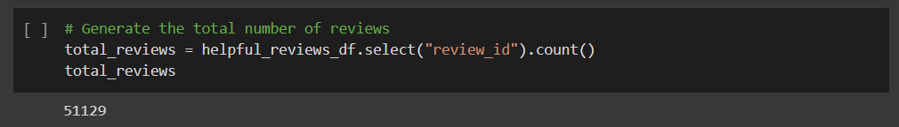
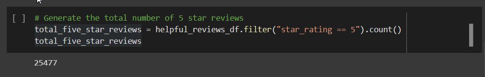
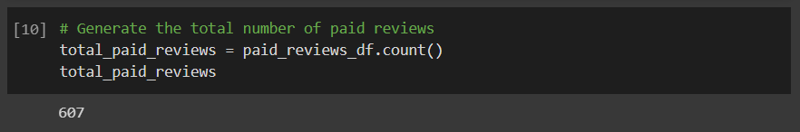
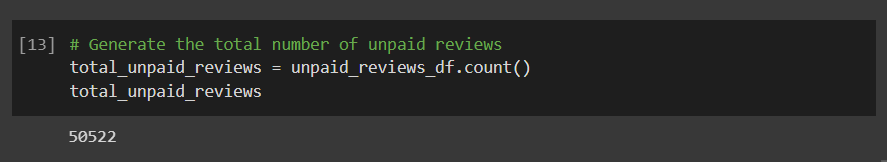
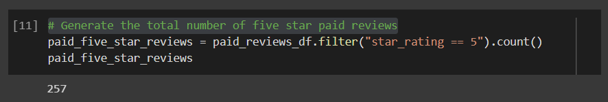
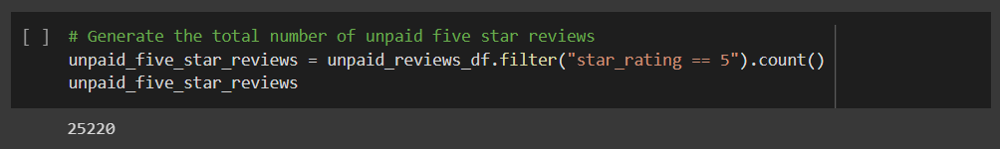
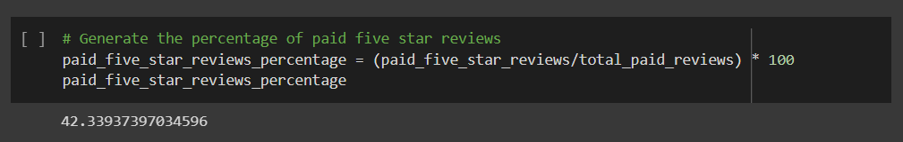
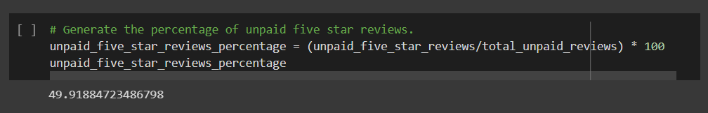

# Amazon_Vine_Analysis

## Overview
The Amazon Vine program is a service that allows manufacturers and publishers to receive reviews for their products. Companies pay a small fee to Amazon and provide products to Amazon Vine members, who are required to publish reviews. 

### Purpose
The purpose of this analysis is to:
- Use PySpark to perform the ETL process to extract the dataset that contains amazon product reviews, transform the data, connect to an AWS RDS instance, and load the transformed data into PostgresSQL database. 
- Use PySpark to determine if there is any bias toward favorable reviews from Vine members in the reviews dataset.

## Analysis

Data Source: 
* [Amazon Vine Reviews](https://s3.amazonaws.com/amazon-reviews-pds/tsv/index.txt) - This analysis was conducted on the camera reviews data set. 

Software used: Google Colab, PySpark, AWS, PostgresSQL

Analysis Code: 
* [Amazon Reviews ETL](Amazon_Reviews_ETL.ipynb)
* [Bias of Vine Reviews Analysis](Vine_Review_Analysis.ipynb)

## Results 
[//]: # (There is a bulleted list that addresses the three questions for unpaid and paid program reviews)

From the dataset, only helpful reviews were selected i.e. with more than 20 votes. This was also done to avoid zero division errors. 

The data was then filtered for reviews that recieved 50% or above "helpful" votes to futher streamline the data for helpful reviews. 

Following are the results (as generated on the [Vine Reviews Analysis](Vine_Review_Analysis.ipynb) ):

As shown above, the total number of reviews in the filtered dataset were 51129. Out of which 25477 were five star reviews. 

### Vine versus Non-Vine Reviews

Out of the total of 51129 reviews, 607 were Vine (paid) reviews and 50522 were non-Vine (unpaid) reviews.

### Five Star Reviews within Vine and Non-Vine Reviews

Out of total Vine reviews of 607, 257 reviews were five star reviews. Out of the total non-Vine reviews of 50522, 25220 reviews were five star reviews. 

### Percentage of Five Star Reviews within Vine and Non-Vine Reviews

About 42% of the Vine reviews were 5 stars.

Roughly 50% of the non-Vine reviews were 5 stars.

## Summary
[//]: # (In your summary, state if there is any positivity bias for reviews in the Vine program. Use the results of your analysis to support your statement. Then, provide one additional analysis that you could do with the dataset to support your statement.)

From the above results, there appears to be no positivity bias for the reviews in the Vine Program. The percentage of five star rating in paid reviews is 42% which is relatively lower than the percentage of five star rating of for unpaid reviews of 50%.  

### Additional Analysis

Although several comparisons can be made between Vine and non-Vine reviews numbers, here's one such idea:

* Average Vine rating versus average non-Vine rating can be compared for every product.

This might give some insight into product by product comparisons for between Vine and non-Vine ratings. 

* Distribution curve analysis for rating within Vine and non-Vine Reviews. 

The ratings from the reviews can be sorted into percentile buckets and visualized in districution curves. This analysis may indicate any trends, or lack of, in the distribution curves of the ratings. 

